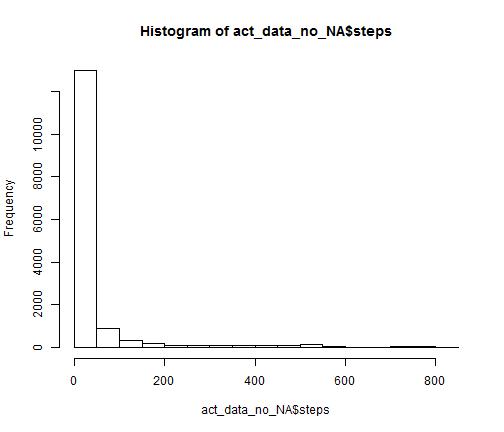
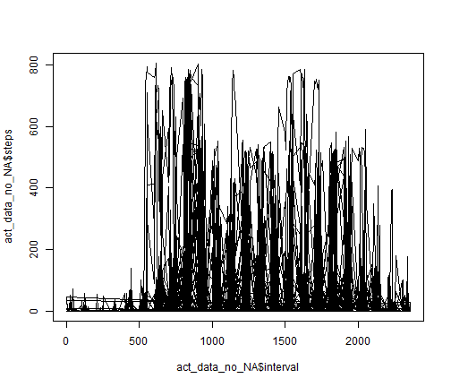
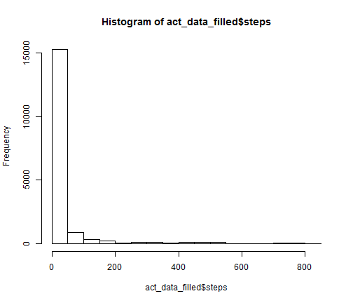
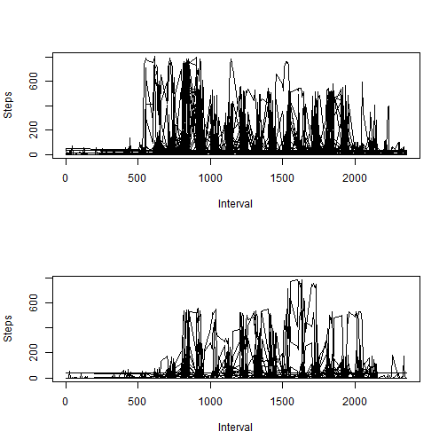

Activity analysis for Coursera course
========================================================

For the Coursera course Reproducible Research we analyse the activities from an unknown individual. These activities are available in the file 'activity.csv'.

This assignment makes use of data from a personal activity monitoring device. This device collects data at 5 minute intervals through out the day. The data consists of two months of data from an anonymous individual collected during the months of October and November, 2012 and include the number of steps taken in 5 minute intervals each day.

First set env to English

```r
Sys.setenv(LANG = "en")
```

<h1>Loading and preprocessing the data</h1>

Loading the data into a variable:


```r
act_data <- read.csv("activity.csv")
```

Creating a seperate variable in which the NA data has been discarded:


```r
act_data_no_NA <- subset(act_data, !is.na(steps))
```
<br /><br /><br /><br /><br />
<h1>What is mean total number of steps taken per day?</h1>

Plot the number of steps in a histogram.


```r
hist(act_data_no_NA$steps)
```

 

Mean and median can be found from this code:

Mean is:

```r
mean(act_data_no_NA$steps)
```

```
## [1] 37.3826
```

Median is:


```r
median(act_data_no_NA$steps)
```

```
## [1] 0
```
<br /><br /><br /><br /><br />
<h1>What is the average daily activity pattern?</h1>

1. Make a time series plot (i.e. type = "l") of the 5-minute interval (x-axis) and the average number of steps taken, averaged across all days (y-axis)

```r
plot(act_data_no_NA$interval,act_data_no_NA$steps,type = "l")
```

 

2. Which 5-minute interval, on average across all the days in the dataset, contains the maximum number of steps?

```r
act_data_small <- act_data[order(act_data$steps,decreasing=TRUE,na.last=TRUE),]
act_data_small[1,]
```

```
##       steps       date interval
## 16492   806 2012-11-27      615
```
<br /><br /><br /><br /><br />
<h1>Imputing missing values</h1>

Note that there are a number of days/intervals where there are missing values (coded as NA). The presence of missing days may introduce bias into some calculations or summaries of the data.

Calculate and report the total number of missing values in the dataset (i.e. the total number of rows with NAs)

```r
act_data_NA <- subset(act_data, is.na(steps))
nrow(act_data_NA)
```

```
## [1] 2304
```

<br />
Devise a strategy for filling in all of the missing values in the dataset. The strategy does not need to be sophisticated. For example, you could use the mean/median for that day, or the mean for that 5-minute interval, etc.
Create a new dataset that is equal to the original dataset but with the missing data filled in.

(replacing with mean over all calculated days for arguments sake (this course is on reproducible research after all, and not on R-coding)...)


```r
act_data_filled <- act_data
act_data_filled[ is.na(act_data_filled) ] <- mean(act_data_no_NA$steps)
```

Make a histogram of the total number of steps taken each day and Calculate and report the mean and median total number of steps taken per day. Do these values differ from the estimates from the first part of the assignment? What is the impact of imputing missing data on the estimates of the total daily number of steps?
Plot the number of steps in a histogram.


```r
hist(act_data_filled$steps)
```

 

Mean and median can be found from this code:

Mean is:

```r
mean(act_data_filled$steps)
```

```
## [1] 37.3826
```

Median is:


```r
median(act_data_filled$steps)
```

```
## [1] 0
```

Since I filled the NAs with the mean value, this mean value overall did not change.

<br /><br /><br /><br /><br />
<h1>Are there differences in activity patterns between weekdays and weekends?</h1>

For this part the weekdays() function may be of some help here. Use the dataset with the filled-in missing values for this part.

Create a new factor variable in the dataset with two levels - weekday and weekend indicating whether a given date is a weekday or weekend day.


```r
act_data_filled$weekday<-weekdays(as.Date(act_data_filled$date))
```

Make a panel plot containing a time series plot (i.e. type = l) of the 5-minute interval (x-axis) and the average number of steps taken, averaged across all weekday days or weekend days (y-axis). See the README file in the GitHub repository to see an example of what this plot should look like using simulated data.


```r
par(mfcol = c(2, 1)) # 2 x 2 pictures on one plot
act_data_weekday <- act_data_filled[which(act_data_filled$weekday!='zaterdag'&act_data_filled$weekday!='zondag'),]
plot(act_data_weekday$interval, act_data_weekday$steps, ,
  xlab="Interval", ylab="Steps",
  mfg=c(1, 1),type="l")
act_data_weekend <- act_data_filled[which(act_data_filled$weekday=='zaterdag'|act_data_filled$weekday=='zondag'),]
plot(act_data_weekend$interval, act_data_weekend$steps,
  xlab="Interval", ylab="Steps",
  mfg=c(2, 1),type="l")
```

 
